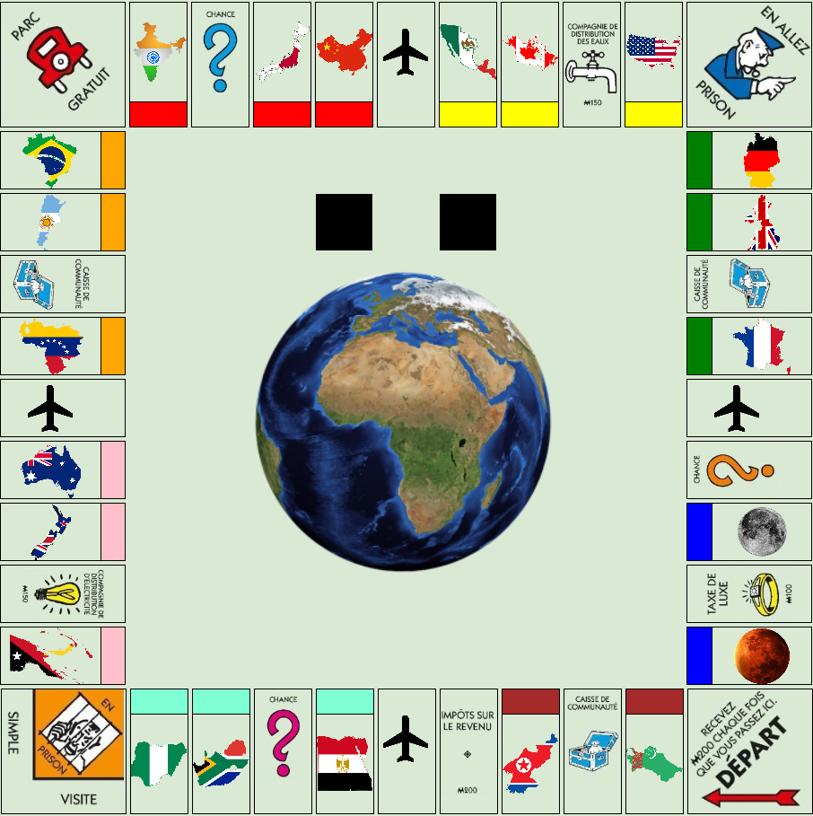

# Jeu le tour du monde en 40 cases.
- [Le jeu](https://baptistebuvron.github.io/Monopoly-isn/index.html)
- [Le Github du projet](https://github.com/BaptisteBuvron/Monopoly-isn)

# Sommaire
1. [HTML](#html)
2. [CSS](#css)
3. [JavaScript](#javascript)
4. [Sources](#sources)

# HTML

*Réalisé par Yann et Baptiste*

Le plateau de jeu est créer entièrement en html et css : 

Chaque case est représenté par une balise `div`.

Chaque `div` peut comporter les classes suivantes:
- `top, left, right, bottom, void, cell` en fonction de leur position
- `property, tax, community-chest, prison, start, free-parking, electric, water` en fonction de leur fonction dans le jeu. 


## Exemple : 

```html
<div id="cell21" class="corner cell top free-parking"></div>
<div id="cell22" class="property cell top" data-group="group5">
    <div class="content"></div>
    <div class="title"></div>
</div>
<div id="cell23" class="top cell"></div>
<div id="cell24" class="property cell top" data-group="group5">
    <div class="content"></div>
    <div class="title"></div>
</div>
```

## Les propriétés

Chaque propriétés possèdent la classe `available` si elle ne possède pas de propriétaire.
Elle possède l'atribut `data-owner=player...` permettant de connaitre le propriétaire de la propriétés.

## Numéro de case

Chaque case possède un id permettant de savoir qu'elle est son numéro de case :
```html
<div id="cell2" class="property bottom" data-group="group1">
            <div class="content"></div>
            <div class="title"></div>
</div>
<div id="cell1" class="corner start"></div>
```
# CSS

*Réalisé par Yann et Baptiste*

Chaque case du jeu est stylisé en fonction de sa classe. Ainsi par exemple : 

Pour les éléments de classe `right` et `left` enfant d'un élément possédant l'id `game` : 

```css

/* Style d'une div étant soit à gauche soit à droite */
#game .right, #game .left{
    width: 140px;
    height: 65px;
}

```

## Les propriétés

Chaque propriétés possèdent une div `content` et `title`. Afin de pouvoir ajouter les joueurs lors du déplacement et également pour différencier les différents groupes de propriétés.


```css
/* Style des div title propriété en haut */
#game .cell.top .title {
    height: 20%;
    border-top: 1px solid black;
    width: 100%;
}

/* Style des div content propriété en haut */
#game .cell.top .content {
    height: 80%;
    width: 100%;
}
```
Chaque propriété possède un groupe, ce groupe est répéré avec l'attribut `data-group="group1"`.

Ainsi la couleur de fond d'écran est définit en fonction de ce `data-group`.

```css
#game [data-group='group1'] .title{
    background-color: brown;
}

#game [data-group='group2'] .title{
    background-color: aquamarine;
}

...
```

## Les cases à fonctions

Les cases à fonctions sont repéré avec leur classe, en fonction de cette classe une image de fond d'écran leur est attribuée.
```html
<div class="corner prison"></div>
```
```css
#game .prison{
    background-image: url('pictures/jail.jpg');
    background-size: contain;
    background-repeat: no-repeat;    
}
```

## Le plateau de jeu



# JavaScript

## Le DOM

Le DOM (Document Object Model) est une interface de notre page WEB. Il va permettre aux javascript de pouvoir lire et manipuler le contenu de la page, sa structure et son style.


 -- <cite>Wikipedia</cite>

## Jquery 

Pour sélectionner les éléments du DOM nous utiliserons la bibliothèque JavaScript Jquery qui a été créer pour facilité l'écriture de scripts côté client dans le code HTML des pages web. Le but de la bibliothèque étant le parcours et la modification du DOM.

Ainsi par exemple : 
```javascript
document.getElementById("id");
```
Devient : 
```javscript
$("#id");
```

## Objet Game

Un objet Game a été créer, toutes les fonctions lier au déroulement du jeu du Game seront des propriétés de l’objet Game :


```javascript
var Game = new Object();
```

## Les propriétés

### Game.start

*Réalisé par Baptiste*

Cette propriété de l'objet Game est appelée au chargement de la page et appelle les propriétés nécessaire au démarrage de la partie.

```javascript
Game.start = function(){
    Game.getNbrPlayer();
};
```

### Game.moneyAtStart

*Réalisé par Baptiste*

Cette propriété de l'objet Game est un entier qui permet de déterminer le montant initial des joueurs au départ du jeu.

```javascript
Game.moneyAtStart = 1500;
```

### Game.allowToDice

*Réalisé par Yann*

Cette propriété de l'objet Game est un booléen qui permet de déterminer quand les joueurs ont le droit de lancer les dés.

```javascript
Game.allowToDice = false;
```

### Game.valueDice

*Réalisé par Baptiste*

Cette propriété de l'objet Game est un entier qui contiendra la valeur total des dés afin de le réutiliser lors des propriétés énergies pour calculer le loyer. 

```javascript
Game.valueDice = null;
```

### Game.counterDice

*Réalisé par Baptiste*

Cette propriété de l'objet Game est un entier qui contiendra le nombre de lancer de dés d'affiler par un joueur. Dans la fonction `Game.changeTurnPlayer` si cette variable est égal à 3 : le joueur est envoyé en prison. 

```javascript
Game.counterDice = 0;
```

### Game.doubleDice

*Réalisé par Baptiste*

Cette propriété de l'objet Game est un booléean qui sera égale à true si le joueur à fait un double avec les dés.

```javascript
Game.doubleDice = false;
```

### Game.rent

*Réalisé par Baptiste*

Cette propriété de l'objet Game est un entier qui contiendra le dernier loyer calculer, il permet de stocker le loyer dans une varible globale.

```javascript
Game.rent = null;
```

### Game.nbrPlayerAlive

*Réalisé par Baptiste*

Cette propriété de l'objet Game est un entier qui contiendra le nombre de personne encore en jeu.

```javascript
Game.nbrPlayerAlive = null;
```


### Game.dice

*Réalisé par Yann*

Cette propriété de l'objet Game permet au joueur de lancer les dés de maniére aléatoire et indépendante. La propriété `Game.movePlayer` est ensuite appelé pour faire avancer le joueur d'un nombre de case.

De plus l'image de la div `dice_1` et `dice_2` est changé en fonction du nombre affiché par la variable `dice_1` et `dice_2`

```javascript
Game.dice = function () {
    if (Game.allowToDice) {
        var dice_1 = Math.floor(Math.random() * 6) + 1; /* retourne un nombre compris entre 1 et 6 */
        var dice_2 = Math.floor(Math.random() * 6) + 1; /* retourne un nombre compris entre 1 et 6 */
        Game.allowToDice = false; /* interdit au joueur de relancer les dés*/

        var total = dice_1 + dice_2;
        total = parseInt(total); /* On verifie que total est un entier */
        Game.valueDice = total;
        if (dice_1 == dice_2) {
            Game.counterDice += 1;
            Game.doubleDice = true;
        }

        var url = "pictures/dice/dice_" + String(dice_1) + ".gif";
        $('#game #dice_1').css({
            "background-image": "url('" + url + "')"
        });
        url = "pictures/dice/dice_" + String(dice_2) + ".gif";
        $('#game #dice_2').css({
            "background-image": "url('" + url + "')"
        });

        Game.movePlayer(Game.getCurrentPlayer(), total);
    }


};
```

### Game.bankPLayer

*Réalisé par Baptiste*

Initialisation de l'objet qui contiendra le montant du compte de chaque joueur.
Clé du de l'objet = "player"+ id du joueur,
Valeur du de l'objet = Montant du compte (int)

```javascript
Game.bankPlayer = new Object();
```

### Game.listCell

*Réalisé par Baptiste*

Initialisation du dictionnaire qui contiendra les propriétés de chaque cellule.
Clé du dictionnaire = id de la cellule,
Valeur = Objet contenant les propriétés de la cellule (objet)

```javascript
Game.listCell = new Map();
```

Modèle de l'objet contenant les propriétés des cellules.

```javascript
function propertiesCell(type, name, picture, group, owner, buy, sell, rent, upgradePrice, level) {
    this.type = type;
    this.name = name;
    this.picture = picture;
    this.group = group;
    this.owner = owner;
    this.buy = buy;
    this.sell = sell;
    this.rent = rent;
    this.upgradePrice = upgradePrice;
    this.level = level;

}

```

Ajout d'une cellule dans le dictionnaire `Game.listCell` avec l'id de la cellule et l'objet contenant les propriétés de la cellule.

```javascript
Game.listCell.set(2, new propertiesCell("property", "Turkmenistan", "turkmenistan.png", "Autre", null, 60, 30, 25, 1));
```

### Game.listChance

*Réalisé par Baptiste*

Initialisation d'une liste qui contiendra le contenu des cases chance sous forme d'objet.

```javascript
Game.listChance = [];
```
Modèle de l'objet contenant les propriétés de la case chance.

```javascript
function addChance(name,presentation,action,number){
    this.name = name;
    this.presentation = presentation;
    this.action = action;
    this.number = number;
};
```
Ajout dans la liste `Game.listChance` l'objet contenant les propriétés d'une carte chance.

```javascript
Game.listChance.push(new addChance("Facture","Vous n'avez pas payer vos factures ! <br>- Vous devez 50€ à la banque","pay",-50));
```

### Game.Région

Une propriété a été créer pour chaque région, la propriété contient dans une liste les id des propriétées situé dans cette région.

```javascript
Game["Autre"] = [2, 4];
Game["Afrique"] = [7, 9, 10];
Game["Océanie"] = [12, 14, 15];
Game["Amérique du Sud"] = [17, 19, 20];
Game["Asie"] = [22, 24, 25];
Game["Amérique du Nord"] = [27, 28, 30];
Game["Europe"] = [32, 33, 35];
Game["Aéroport"] = [6, 16, 26, 36];
Game["energie"] = [13, 29];
```

### Game.getNbrPlayer

*Réalisé par Baptiste*

Cette propriété de l'objet Game est appelée par `Game.start` et demande à l'utilisateur le nombre de joueurs.Tant que le nombre indiqué n'est pas entre 2 et 5 la propriété est rappelée. Sinon la propriété `Game CreatePlayer` est appelée.

Aucun paramètre n'est nécessaire.

```javascript
Game.getNbrPlayer = function () {
    $(document).ready(function () {
        $("#modal-player").modal('show');

    });
    $("#button-nbrPlayer").click(getNbrPlayer);


    function getNbrPlayer() {
        var nbrPlayer = 0;
        nbrPlayer = parseInt($("#nbrPlayer").val());
        if (nbrPlayer <= 5 && nbrPlayer >= 2) {
            $("#modal-player").modal('hide');
            Game.createPlayer(nbrPlayer);
        }
    }

};
```

### Game.createPlayer

*Réalisé par Baptiste*

Cette propriété de l'objet Game est appelé par `Game.getNbrPlayer` et permet de créer le nombre de joueur demandé.
Il initialise également le compte en banque des joueurs.

Paramètre :
- Le nombre de joueur a créer (int).

```javascript
Game.createPlayer = function (nbrPlayer) {

    for (let i = 1; i <= nbrPlayer; i++) {
        if (i == 1) {
            $('<div id="player' + String(i) + '" class="player current-turn"></div>').appendTo('#game .start .content');
        } else {
            $('<div id="player' + String(i) + '" class="player"></div>').appendTo('#game .start .content');
        }
        Game.bankPlayer["player"+ String(i)] = Game.moneyAtStart;


    }
    Game.allowToDice = true;

};
```


### Game.getCurrentPlayer

*Réalisé par Baptiste*

Cette propriété de l'objet Game permet de retourner du `DOM` le joueur qui possède la classe curent-turn.

Aucun paramètre n'est nécessaire.

```javascript
Game.getCurrentPlayer = function(){
    return $(".player.current-turn");
};
```

### Game.getClosestCell

*Réalisé par Baptiste*

Cette propriété de l'objet Game permet de retourner du `DOM` la cellule la plus proche d'un joueur et qui possède la classe `cell`.

Les paramètres :
- L'élément du DOM d'un joueur.

```javascript
Game.getClosestCell= function(player){
    return player.closest(".cell");
};
```

### Game.getIdCell

*Réalisé par Baptiste*

Cette propriété de l'objet Game permet de retourner l'id d'une cellule (int).
Cette propriété utilise la methode replace qui remplace dans l'id de la cellule cell par une chaine de caractère vide afin de récuperer seulement l'id de la cellule.

Les paramètres :
- L'élément du DOM d'un cellule.

```javascript
Game.getIdCell = function(playerCell){
    return parseInt(playerCell.attr('id').replace("cell",""));
}
```

```html
<div id="cell36"></div>
```

### Game.getIdplayer

*Réalisé par Baptiste*

Cette propriété de l'objet Game permet de retourner l'id d'un joueur (int).

Les paramètres :
- L'élément du DOM d'un joueur.

```javascript
Game.getIdPlayer = function (player) {
    return parseInt(player.attr("id").replace("player", ""));
}
```

### Game.getNextCell

*Réalisé par Baptiste*

Cette propriété de l'objet Game permet de retourner la cellule suivante.
De plus elle appelle la propriété `Game.addMoneyPlayer` quand un tour a été effectué.

Les paramètres :
- L'id de la cellule précédente (int).

```javascript
Game.getNextCell = function (idCell) {
    if (idCell == 40) {
        idCell = 0;
        Game.updateMoneyPlayer(Game.getIdPlayer(Game.getCurrentPlayer()), 200);
    }
    var nextIdCell = idCell + 1;
    return $("#game .cell#cell" + nextIdCell);


}
```

### Game.movePlayer

*Réalisé par Baptiste*

Cette propriété de l'objet Game permet de faire avancer un joueur de `number` case.

Les paramètres :
- L'élement du DOM correspondant au joueur a déplacer,
- Le nombre de case a avancé (int).

```javascript
Game.movePlayer = function (player, number) {
    Game.allowToDice = false;

    var movePlayerInterval = setInterval(movePLayer, 500);

    function movePLayer() {

        var cellPlayer = Game.getClosestCell(player);
        var idCell = Game.getIdCell(cellPlayer);
        var nextCell = Game.getNextCell(idCell);

        nextCell.find('.content').append(player);
        number--;
        if (number == 0) {
            clearInterval(movePlayerInterval);
            cellPlayer = Game.getClosestCell(player);
            Game.action(player, cellPlayer);
        }
    }

};
```

### Game.updateMoneyPlayer

*Réalisé par Baptiste*

Cette propriété de l'objet Game permet de modifier le montant d'un compte d'un joueur.

Les paramètres : 
- L'id d'un joueur (int),
- Le montant a enlever ou ajouter sur le compte (int).

```javascript
Game.updateMoneyPlayer = function (idPlayer, amount) {
    var money = Game.getMoneyPlayer(idPlayer);
    var newMoney = money + amount;
    Game.bankPlayer["player" + String(idPlayer)] =  newMoney;

};
```
### Game.getMoneyPlayer

*Réalisé par Baptiste*

Cette propriété de l'objet Game permet de retourner le montant d'un compte d'un joueur.

Les paramètres : 
- L'id du joueur (int).

```javascript
Game.getMoneyPlayer = function (idPlayer) {
    return parseInt(Game.bankPlayer["player" + String(idPlayer)]);
};
```

### Game.action

*Réalisé par Baptiste*

Cette propriété de l'objet Game appelle différentes fonctions en fonction de la position d'un joueur après déplacement. 

Les paramètres : 
- L'élément du DOM d'un joueur.
- L'élément du DOM de la case du joueur.

```javascript
Game.action = function (player, playerCell) {
    var idPlayer = Game.getIdPlayer(player);
    var idCell = Game.getIdCell(playerCell)
    if (playerCell.hasClass("property")) {

        if (playerCell.hasClass("available")) {

            Game.buyProperty(idCell);

        } else {
            var idOwner = parseInt(playerCell.attr("data-owner").replace("player", ""));
            if (idOwner == idPlayer) {
                Game.changeTurnPlayer();
            } else {
                Game.payRent(idOwner, idPlayer, idCell);
            }
        }
    } else if (playerCell.hasClass("chance")) {
        Game.chance("chance");

    } else if (playerCell.hasClass("tax")) {
        Game.tax(idCell);
    } else if (playerCell.hasClass("go-to-jail")) {
        Game.sendJail(player);
    } else if (playerCell.hasClass("corner")) {
        Game.changeTurnPlayer();
    } else if (playerCell.hasClass("community-chest")) {
        Game.chance("community-chest");
    } else {
        Game.changeTurnPlayer();

    }


};
```

### Game.calcRent

*Réalisé par Baptiste*

Cette propriété de l'objet Game permet de retourner le montant du loyer d'une propriété en fonction de son level. Pour les aéroports ou propriétés d'énergie elle verifie si le propriétaire possède plusieurs aéroports ou propriétés d'énergies.

Les paramètres : 
- L'id de la cellule (int).

```javascript
Game.calcRent = function (idCell) {
    var rent = Game.listCell.get(idCell)["rent"];
    var level = Game.listCell.get(idCell)["level"];
    switch (level) {
        case 0:
            rent = rent;
            break;
        case 1:
            rent = rent * 5;
            break;
        case 2:
            rent = rent * 15;
            break;
        case 3:
            rent = rent * 45;
            break;
        case 4:
            rent = rent * 80;
            break;
        case 5:
            rent = rent * 125;
            break;
    }

    var currentCell = Game.getClosestCell(Game.getCurrentPlayer());
    var idOwner = parseInt(currentCell.attr("data-owner").replace("player", ""));
    if (currentCell.hasClass("airport")) {
        level = 0;
        for (let i = 0; i < Game["Aéroport"].length; i++) {
            if ($("#game .cell#cell" + String(Game["Aéroport"][i])).attr("data-owner").replace("player", "") == idOwner) {
                level += 1;
            }       
            
            
        }
        switch (level) {
            case 1:
                rent = 25;
                break;
            case 2:
                rent = 50;
                break;
            case 3:
                rent = 100;
                break;
            case 4:
                rent = 200;
                break;
        }

    } else if (currentCell.hasClass("energy")) {
        level = 0;
        for (let i = 0; i < Game["energie"].length; i++) {
            if ($("#cell" + Game["energie"][i]).attr("data-owner").replace("player", "") == idOwner) {
                level += 1;
            }
        }
        switch (level) {
            case 1:
                rent = 4 * Game.valueDice;
                break;
            case 2:
                rent = 10 * Game.valueDice;
                break;
        }
    }

    return rent;

};
```

### Game.buyProperty

*Réalisé par Baptiste*

Cette propriété de l'objet Game permet à l'aide d'une fenêtre d'acheter une propriété. Si le joueur ne possède pas assez d'argent un message d'erreur s'affiche et la fenêtre se ferme après 2 secondes.

Les paramètres : 
- L'id de la cellule de la propriété(int).

```javascript
Game.buyProperty = function (idCell) {
    var rent = Game.calcRent(idCell);
    var idPlayer = Game.getIdPlayer(Game.getCurrentPlayer());
    var click = false; /*Variable pour empecher un double appelle de la fonction buy */
    $("#modal-buyProperty img").attr('src', "pictures/pais/" + Game.listCell.get(idCell)['picture']);
    $("#modal-buyProperty .modal-title").html("Acheter la propriété : " + Game.listCell.get(idCell)["name"]);
    $("#modal-buyProperty #buy").html("Prix d'achat : " + Game.listCell.get(idCell)["buy"] + " €");
    $("#modal-buyProperty #sell").html("Prix de vente: " + Game.listCell.get(idCell)["sell"] + " €");
    $("#modal-buyProperty #money").html("Votre solde : " + Game.getMoneyPlayer(idPlayer) + " €");
    $("#modal-buyProperty #rent").html("Prix du loyer : " + rent + " €");
    $("#modal-buyProperty").modal('show');

    $("#modal-buyProperty #button-buyProperty").click(function () {
        if (click == false) {
            click = true;
            buyProperty();
        }

    });
    $("#modal-buyProperty #button-quit").click(function () {
        if (click == false) {
            click = true;
            $("#modal-buyProperty").modal('hide');
            Game.changeTurnPlayer();
        }
    });

    function buyProperty() {
        var price = Game.listCell.get(idCell)['buy'];
        var idPlayer = Game.getIdPlayer(Game.getCurrentPlayer());
        var cellPlayer = Game.getClosestCell(Game.getCurrentPlayer())
        if (Game.verifBank(idPlayer, price)) {
            Game.updateMoneyPlayer(idPlayer, -price);
            Game.listCell.get(idCell)["owner"] = "player" + idPlayer;
            $(cellPlayer).removeClass("available ");
            $(cellPlayer).attr("data-owner", "player" + String(idPlayer));
            $("#modal-buyProperty").modal("hide");
            Game.changeTurnPlayer();

        } else {
            $("#modal-buyProperty #error").html("Vous n'avez pas assez d'argent dans votre compte en banque !");
            setTimeout(hideModal, 2000);

        }

    }

    function hideModal() {
        $("#modal-buyProperty").modal("hide");
        Game.changeTurnPlayer();
    }


};
```


### Game.payRent

*Réalisé par Baptiste*

Cette propriété de l'objet Game permet de faire payer le montant du loyer d'une propriété. De plus une fenêtre est ouverte pour inviter le joueur à payer le loyer. Si le joueur ne possède pas assez d'argent il est invité a vendre des propriétés (fonctionnalité non présente).

Les paramètres : 
- L'id du propriétaire de la propriété(int),
- L'id du joueur qui doit payer le loyer(int),
- L'id de la cellule de la propriété(int).

```javascript
Game.payRent = function (idOwner, idPlayer, idCell) {
    var rent = Game.calcRent(idCell);

    var click = false; /*Variable pour empecher un double appelle de la fonction buy */
    $("#modal-payRent img").attr('src', "pictures/pais/" + Game.listCell.get(idCell)['picture']);
    $("#modal-payRent .modal-title").html("Acheter la propriété : " + Game.listCell.get(idCell)["name"]);
    $("#modal-payRent #money").html("Votre solde : " + Game.getMoneyPlayer(idPlayer) + " €");
    $("#modal-payRent #rent").html("Prix du loyer : " + rent + " €");
    $("#modal-payRent #info").html("");
    $("#modal-payRent").modal('show');


    $("#modal-payRent #button-payRent").click(function () {
        if (click == false) {
            click = true;
            payRent();
        }
    });

    function payRent() {
        if (Game.verifBank(idPlayer), rent) {
            Game.updateMoneyPlayer(idOwner, rent);
            Game.updateMoneyPlayer(idPlayer, -rent);
            $("#modal-payRent #info").html("Vous avez payer le loyer de " + rent + " €");
            setTimeout(hideModal, 2000);
        } else {
            /*Game.sellProperty(rent);*/
            $("#modal-payRent #info").html("Vous n'avez pas assez d'argent.");
            setTimeout(hideModal, 2000);
        }
    }

    function hideModal() {
        $("#modal-payRent").modal('hide');
        Game.changeTurnPlayer();
    }


};
```

### Game.verifBank

*Réalisé par Baptiste*

Cette propriété de l'objet Game permet de vérifier si un joueur dispose suffisament d'argent pour payer un loyer par exemple.
True est retourné si le compte contient suffisament d'argent sinon False est retourné.

Les paramètres : 
- L'id du joueur qui doit payer le loyer(int),
- Le montant à payer(int).

```javascript
Game.verifBank = function (idPlayer, amount) {
    var money = Game.getMoneyPlayer(idPlayer);
    if (money - amount >= 0) {
        return true;
    } else {
        return false;
    }
}
```

### Game.changeTurnPlayer

*Réalisé par Baptiste*

Cette propriété de l'objet Game permet de passer au joueur suivant. La fonction traite différent cas : si le joueur a fait un double il peut rejouer, si il a fait un double trois fois de suite il est envoyé en prison. Si le joueur suivant est en prison on lui demande si il veut payer pour être libéré ou de lancer les dés et de tenter de faire un double, sinon il reste en prison. 

```javascript
Game.changeTurnPlayer = function () {
    var player = Game.getCurrentPlayer();
    var idPlayer = Game.getIdPlayer(Game.getCurrentPlayer());
    var idNextPlayer;
    if (Game.doubleDice) {
        if (Game.counterDice == 3) {
            Game.sendJail(player);
            Game.counterDice = 0;
            Game.changeTurnPlayer();
        } else if (Game.counterDice > 0) {
            Game.allowToDice = true;

        }
        Game.doubleDice = false;
    } else {
        Game.counterDice = 0;
        if (idPlayer == Game.nbrPlayer) {
            idNextPlayer = 1;
        } else {
            idNextPlayer = idPlayer + 1;
        }
        $(player).removeClass("current-turn");
        player = $("#player" + String(idNextPlayer));
        player.addClass("current-turn");

        if (player.hasClass("jailed")) {
            player = Game.getCurrentPlayer();
            var timeJail = $(player).attr("data-jail");
            timeJail = timeJail - 1;
            if (timeJail == 0) {
                $(player).removeClass("jailed");
                $(player).removeAttr("data-jail");
                Game.changeTurnPlayer();
            } else {
                $(player).attr("data-jail", timeJail);
                Game.tryLeaveJail();
            }
        } else {
            Game.allowToDice = true;
        }


    }

}
```

### Game.sendJail

*Réalisé par Baptiste*

Cette propriété de l'objet Game permet d'envoyer un joueur en prison.

Les paramètres : 
- L'élément du DOM d'un joueur.

```javascript
Game.sendJail = function (player) {
    $("#game .jail ").find('.content').append(player);
    $(player).attr("data-jail", 3);
    $(player).addClass("jailed");
    Game.changeTurnPlayer();
}
```

### Game.chance

*Réalisé par Baptiste*

Cette propriété de l'objet Game est appelé lorsque un joueur tombe sur une case chance ou community-chest. Elle tire au sort dans la la liste `Game.listChance` et réaliser l'action (avancer joueur, ajouter ou retirer de l'argent ...).
Une fenêtre est ouverte pour afficher différente information au joueur.

Les paramètres : 
- Le type de case sur lequelle est tombé le joueur ("change" ou "community-chest") (str)

```javascript
Game.chance = function (type) {
    if (type == "chance") {
        var len = Game.listChance.length;
        var object = Game.listChance;


    } else if (type == "community-chest") {
        var len = Game.listCommunityChest.length;
        var object = Game.listCommunityChest;

    }

    var click = false;
    var random = Math.floor(Math.random() * (len - 1)); /*Nombre entre [0, 1[ * len(non compris) */

    var chance = object[random];
    var player = Game.getCurrentPlayer();
    var idPlayer = Game.getIdPlayer(player);

    $("#modal-chance .modal-title").html("Chance : ");
    $("#modal-chance #name").html("Type : " + chance["name"]);
    $("#modal-chance #presentation").html(chance["presentation"]);
    $("#modal-chance #action").html("");
    $("#modal-chance #money").html("Votre solde : " + Game.getMoneyPlayer(idPlayer) + " €");
    $("#modal-chance #button-validate").html("OK");
    $("#modal-chance").modal('show');
    $("#modal-chance #button-validate").click(function () {
        if (click == false) {
            click = true;
            chanceAction();
        }
    });

    function chanceAction() {
        switch (chance["action"]) {
            case "pay":
                if (Game.verifBank(idPlayer, chance["number"])) {
                    Game.updateMoneyPlayer(idPlayer, chance["number"]);
                    $("#modal-chance #money").html("Votre solde : " + Game.getMoneyPlayer(idPlayer) + " €");
                } else {
                    $("#modal-chance #error").html("Vous n'avez pas assez d'argent dans votre compte en banque.<br>Des propriétés dont vous êtes le propriétaire vous être vendu.");
                    Game.sellProperty(chance["number"]);
                }
                Game.changeTurnPlayer();
                $("#modal-chance").modal('hide');


                break;

            case "move":
                $("#modal-chance").modal('hide');
                Game.movePlayer(player, chance["number"]);
                break;
        }
    }

}
```

### Game.tax 

*Réalisé par Baptiste*

Cette propriété de l'objet Game est appelé lorsque un joueur tombe sur une case taxe. Elle récupère le montant de la taxte dans le dictionnaire `Game.listCell`. Une fenêtre est ouverte pour afficher différente information au joueur.

Les paramètres : 
- L'id du d'une case(int)

```javascript
Game.tax = function (idCell) {
    var tax = Game.listCell.get(idCell);
    var idPlayer = Game.getIdPlayer(Game.getCurrentPlayer());
    var click = false;
    $("#modal-chance .modal-title").html("Taxe : ");
    $("#modal-chance #name").html("Type : " + tax["name"]);
    $("#modal-chance #presentation").html("");
    $("#modal-chance #action").html("Vous devez payer : " + tax["rent"] + " €");
    $("#modal-chance #money").html("Votre solde : " + Game.getMoneyPlayer(idPlayer) + " €");
    $("#modal-chance #button-validate").html("Payer");
    $("#modal-chance").modal('show');

    $("#modal-chance #button-validate").click(function () {
        if (click == false) {
            taxAction();
            click = true;
        }
    });

    function taxAction() {
        if (Game.verifBank(idPlayer, tax["rent"])) {
            Game.updateMoneyPlayer(idPlayer, -tax["rent"]);
            $("#modal-chance #money").html("Votre solde : " + Game.getMoneyPlayer(idPlayer) + " €");
        } else {
            $("#modal-chance #error").html("Vous n'avez pas assez d'argent dans votre compte en banque.<br>Des propriétés dont vous êtes le propriétaire vont être vendu.");
            sleep(2000);
            Game.sellProperty(tax["rent"]);
        }
        $("#modal-chance").modal('hide');
        Game.changeTurnPlayer();

    }
}
```

### Game.tryLeaveJail

*Réalisé par Baptiste*

Cette propriété de l'objet Game est appelé lorsque un joueur essaye de quitter la prison. On lui demande si il veut payer pour être libéré ou de lancer les dés et de tenter de faire un double, sinon il reste en prison.  Une fenêtre est ouverte pour afficher différente information au joueur. 

```javascript
Game.tryLeaveJail = function () {
    var player = Game.getCurrentPlayer();
    var idPlayer = Game.getIdPlayer(player);
    var click = false;
    $("#modal-tryLeaveJail .modal-title").html("Prison : ");
    $("#modal-tryLeaveJail").modal('show');
    $("#modal-tryLeaveJail #button-buyJail").click(function () {
        if (click == false) {
            click = true;
            buyJail();
        }
    });

    $("#modal-tryLeaveJail #button-Dice").click(function () {
        if (click == false) {
            click = true;
            diceJail();
        }
    });

    $("#modal-tryLeaveJail #button-quit").click(function () {
        if (click == false) {
            click = true;
            $("#modal-tryLeaveJail").modal('hide');
            Game.changeTurnPlayer();
        }
    });

    function buyJail() {
        if (Game.verifBank(idPlayer, 50)) {
            Game.updateMoneyPlayer(idPlayer, -50);
            $(player).removeClass("jailed");
            $(player).removeAttr("data-jail");
            $("#modal-tryLeaveJail #info").html("Vous avez corrompu la prison. Vous sortez de prison ! ");
            setTimeout(hideModal, 2000);

        } else {
            $("#modal-tryLeaveJail #info").html("Vous n'avez pas assez d'argent.");
            click = true;
        }
    }

    function diceJail() {
        var dice_1 = Math.floor(Math.random() * 6) + 1; /* retourne un nombre compris entre 1 et 6 */
        var dice_2 = Math.floor(Math.random() * 6) + 1; /* retourne un nombre compris entre 1 et 6 */
        if (dice_1 == dice_2) {
            $(player).removeClass("jailed");
            $(player).removeAttr("data-jail");
            $("#modal-tryLeaveJail #info").html("Vous avez fait un double : Vous sortez de prison !");
            setTimeout(hideModal, 2000);
        } else {
            $("#modal-tryLeaveJail #info").html("Vous n'avez pas fait un double : Vous restez en prison !");
            setTimeout(hideModal, 2000);

        }
    }

    function hideModal() {
        $("#modal-tryLeaveJail").modal("hide");
        Game.changeTurnPlayer();
    }
};
```

### Game.upgradeProperty

*Réalisé par Baptiste*

Cette propriété de l'objet Game est appelé avant qu'un joueur lance le dé. Elle lui donne la possibilité d'améliorer ou de désaméliorer un propriété qu'il possède.

```javascript
Game.upgradeProperty = function(){
    if(Game.allowToDice){
        var listProperty= new Array();
        var player = Game.getCurrentPlayer(); 
        var idPlayer = Game.getIdPlayer(player);
        Game.listCell.forEach(function (value, key, map) {
            if (value["owner"] == "player" + String(idPlayer)) {
                listProperty.push(key);
            }
        });
        $("#game .cell[data-owner='player"+String(idPlayer)+"']").css('border', '2px solid yellow');
        $("#game .cell[data-owner='player"+String(idPlayer)+"']").click(function(){
            var cell = $(this);
            var idCell = Game.getIdCell(cell);
            var level = Game.listCell.get(idCell)["level"];
            if(level !=  null){
                var click = false; /*Variable pour empecher un double appelle de la fonction buy */
                // $("#modal-upgradeProperty img").attr('src', "pictures/pais/" + Game.listCell.get(idCell)['picture']);
                $("#modal-upgradeProperty .modal-title").html("Améliorer la propriété : " + Game.listCell.get(idCell)["name"]);
                $("#modal-upgradeProperty #money").html("Votre solde : " + Game.getMoneyPlayer(idPlayer) + " €");
                $("#modal-upgradeProperty #level").html("Level actuel : " + String(level));
                $("#modal-upgradeProperty #upgrade").html("Améliorer la propriété : " + Game.listCell.get(idCell)["upgradePrice"] +" €");
                $("#modal-upgradeProperty #downgrade").html("Désaméliorer la propriété : " + Game.listCell.get(idCell)["upgradePrice"] /2 +" €");
                $("#modal-upgradeProperty #error").html("");
                $("#modal-upgradeProperty").modal('show');

                $("#modal-upgradeProperty #button-upgradeProperty").click(function () {
                    if (click == false) {
                        click = true;
                        upgradeProperty();
                    }

                });

                $("#modal-upgradeProperty #button-downgradeProperty").click(function () {
                    if (click == false) {
                        click = true;
                        downgradeProperty();
                    }

                });


                $("#modal-upgradeProperty #button-quit").click(function () {
                    $("#modal-upgradeProperty").modal('hide');
                });
            
            }
            function upgradeProperty(){
                if(level != 5){
                    var upgradePrice = Game.listCell.get(idCell)["upgradePrice"];
                    if(Game.verifBank(idPlayer, upgradePrice)){
                        Game.updateMoneyPlayer(idPlayer, - upgradePrice);
                        Game.listCell.get(idCell)["level"] +=1;
                        $("#modal-upgradeProperty #error").html("Vous avez améliorer la propriété.");
                        setTimeout(hideModal, 2000);
                    }
                    else{
                        $("#modal-upgradeProperty #error").html("Vous n'avez pas assez d'argent pour améliorer la propriété.");
                        click = false;

                    }
                }
                else{
                    $("#modal-upgradeProperty #error").html("La propriété ne peux plus être améliorer d'avantage.");
                    click = false;
                }
            }

            function downgradeProperty(){
                if(level > 0){
                    var downgradePrice = Game.listCell.get(idCell)["upgradePrice"] /2;
                    
                    Game.updateMoneyPlayer(idPlayer, downgradePrice);
                    Game.listCell.get(idCell)["level"] -=1;
                    $("#modal-upgradeProperty #error").html("Vous avez désaméliorer la propriété.");
                    setTimeout(hideModal, 2000);
                }
                else{
                    $("#modal-upgradeProperty #error").html("La propriété ne peux plus être désaméliorer d'avantage.");
                }
            }

            function hideModal() {
                /*Delete css and click fonction from upgradeProperty */
                $("#game .cell[data-owner='player"+String(idPlayer)+"']").css('border', '1px solid black');
                $("#game .cell[data-owner='player"+String(idPlayer)+"']").unbind();
                $("#modal-upgradeProperty").modal("hide");
            }
            
            
        });
    }
   

};
```

# Sources

# Les images

Les images du plateau de Game proviennent du site [commons Wikipedia](https://commons.wikimedia.org), il s'agit d'une  bibliothèque de média libre de droit.

